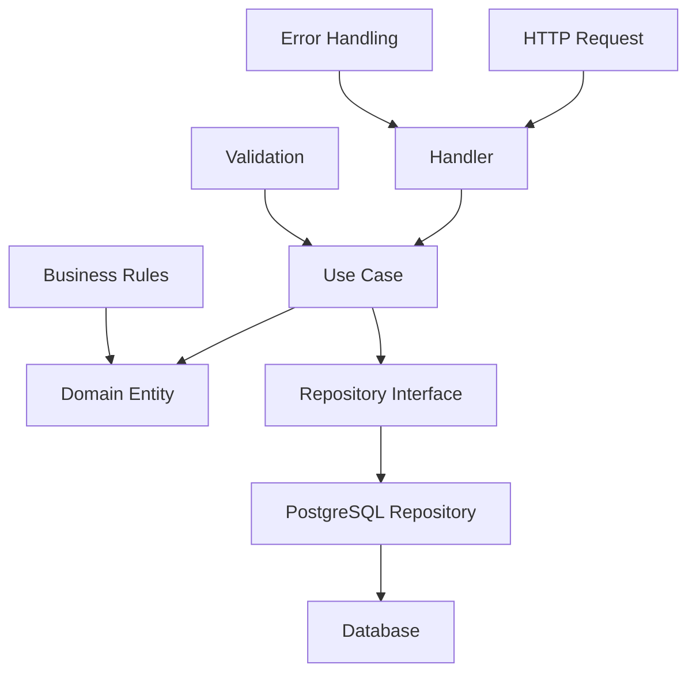

# 👤 Módulo de Usuários

> **🎯 Objetivo:** Gerenciar usuários do sistema com operações CRUD completas, seguindo os princípios da Arquitetura Hexagonal.

## 📚 O que você vai aprender aqui?

Este módulo é um **exemplo perfeito** de como implementar uma funcionalidade completa seguindo as melhores práticas de desenvolvimento:

- ✅ **Domain-Driven Design (DDD)** - Entidades e regras de negócio
- ✅ **Clean Architecture** - Separação clara de responsabilidades  
- ✅ **Use Cases** - Casos de uso bem definidos
- ✅ **Repository Pattern** - Abstração da persistência
- ✅ **HTTP Handlers** - Controllers limpos e testáveis

## 🏗️ Estrutura do Módulo

```
user/
├── 📄 README.md                    # Este arquivo - visão geral do módulo
├── 📁 domain/                      # 🧠 Camada de Domínio
│   ├── 📄 README.md               # Entidades e regras de negócio
│   ├── user.go                    # Entidade User
│   ├── repository.go              # Interface do repositório
│   └── errors.go                  # Erros específicos do domínio
├── 📁 application/                # 🎯 Camada de Aplicação
│   ├── 📄 README.md               # Use cases e orquestração
│   ├── create_user.go            # Caso de uso: criar usuário
│   ├── get_user.go               # Caso de uso: buscar usuário
│   ├── list_users.go             # Caso de uso: listar usuários
│   ├── update_user.go            # Caso de uso: atualizar usuário
│   └── delete_user.go            # Caso de uso: deletar usuário
├── 📁 infrastructure/             # 🗄️ Camada de Infraestrutura
│   ├── 📄 README.md               # Implementação de repositórios
│   └── postgres/                  # Implementação PostgreSQL
│       ├── repository.go          # Repositório PostgreSQL
│       └── user.go               # Modelo de dados
└── 📁 presentation/              # 🌐 Camada de Apresentação
    ├── 📄 README.md               # Handlers HTTP e DTOs
    ├── http/                      # Handlers HTTP
    │   ├── handler.go             # Controllers HTTP
    │   ├── routes.go              # Definição de rotas
    │   └── dto.go                 # Data Transfer Objects
```

## 🎯 Funcionalidades Implementadas

### 1. **Criação de Usuários** (`POST /users`)
- ✅ Validação de dados de entrada
- ✅ Verificação de email único
- ✅ Hash seguro da senha (bcrypt)
- ✅ Criação de UUID único

### 2. **Busca de Usuário** (`GET /users/:id`)
- ✅ Validação de UUID
- ✅ Tratamento de usuário não encontrado
- ✅ Serialização segura (sem senha)

### 3. **Listagem de Usuários** (`GET /users`)
- ✅ Paginação (limit/offset)
- ✅ Validação de parâmetros
- ✅ Metadados de paginação

### 4. **Atualização de Usuário** (`PUT /users/:id`)
- ✅ Validação de dados
- ✅ Atualização de perfil
- ✅ Timestamps automáticos

### 5. **Exclusão de Usuário** (`DELETE /users/:id`)
- ✅ Soft delete (não remove do banco)
- ✅ Marcação de timestamp
- ✅ Preservação de dados

## 🔄 Fluxo de Dados



## 🧪 Como Testar

### 1. **Criar um usuário:**
```bash
curl -X POST http://localhost:8080/users \
  -H "Content-Type: application/json" \
  -d '{
    "name": "João Silva",
    "email": "joao@example.com",
    "password": "12345678",
    "phone": "+5511999999999"
  }'
```

### 2. **Buscar usuário:**
```bash
curl http://localhost:8080/users/{user-id}
```

### 3. **Listar usuários:**
```bash
curl "http://localhost:8080/users?limit=10&offset=0"
```

## 🎓 Conceitos Aplicados

### **Domain-Driven Design (DDD)**
- **Entidade:** `User` com identidade única (UUID)
- **Value Objects:** Email, senha hasheada
- **Regras de Negócio:** Validações na entidade
- **Repositório:** Interface abstrata para persistência

### **Clean Architecture**
- **Independência:** Camadas não dependem de frameworks
- **Testabilidade:** Fácil de testar unitariamente
- **Flexibilidade:** Trocar banco de dados sem afetar lógica

### **SOLID Principles**
- **S** - Single Responsibility: Cada classe tem uma responsabilidade
- **O** - Open/Closed: Extensível sem modificação
- **L** - Liskov Substitution: Interfaces bem definidas
- **I** - Interface Segregation: Interfaces específicas
- **D** - Dependency Inversion: Dependências abstratas

## 🚀 Próximos Passos

1. **Leia os READMEs de cada camada** para entender os detalhes
2. **Explore o código** seguindo o fluxo de dados
3. **Execute os testes** para ver funcionando
4. **Modifique e experimente** para aprender na prática

---

> **💡 Dica:** Este módulo é um template perfeito para criar outros módulos do sistema. Use-o como referência para implementar funcionalidades como produtos, pedidos, pagamentos, etc.
